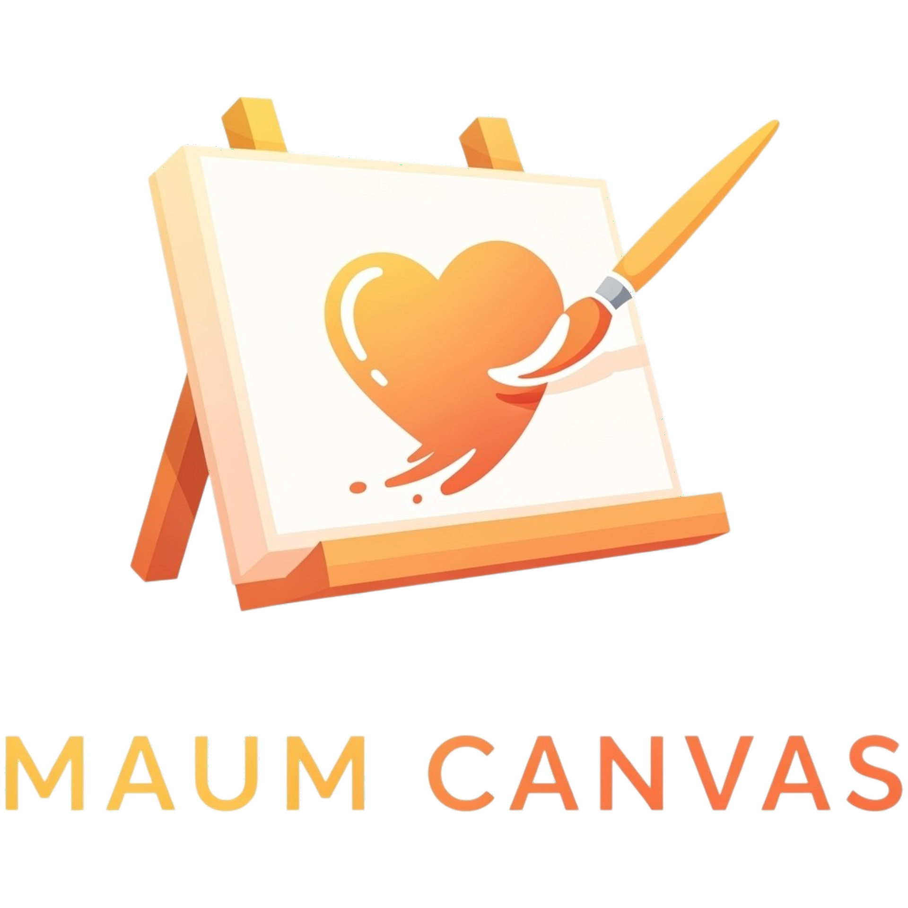
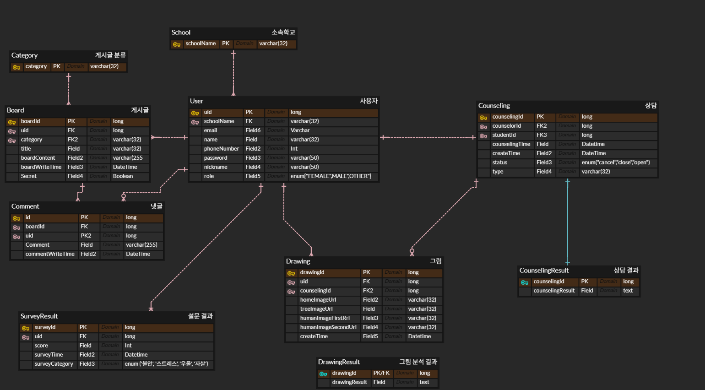
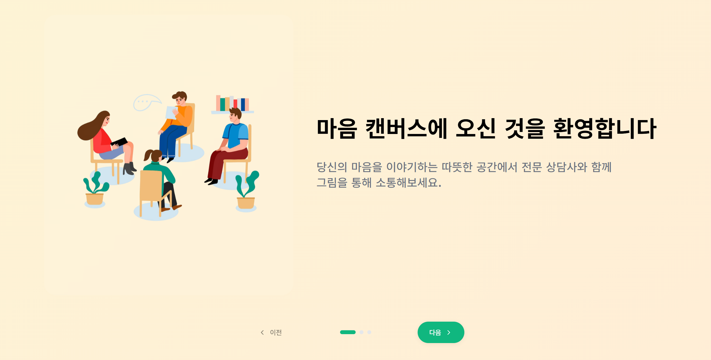
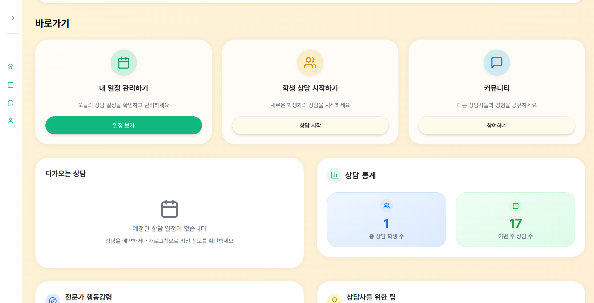
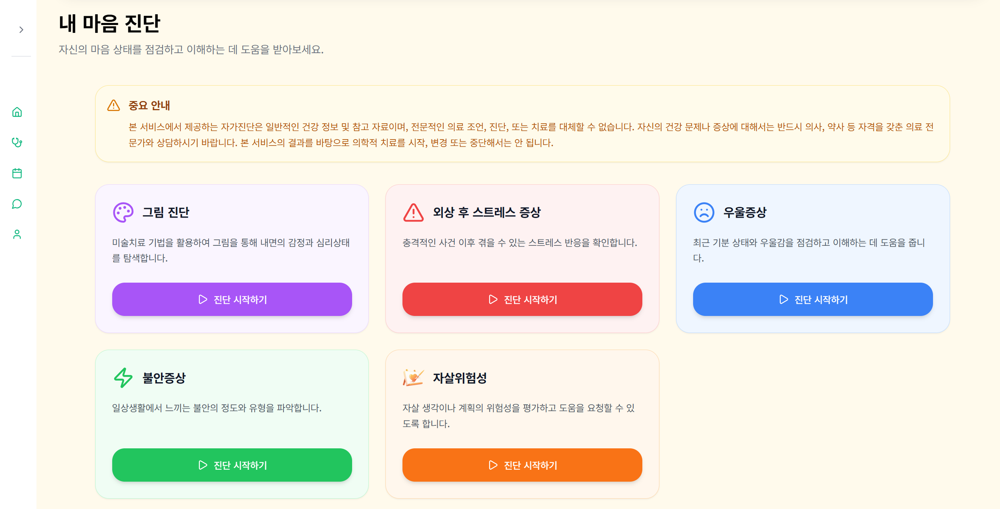
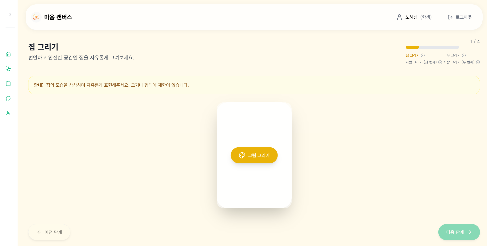
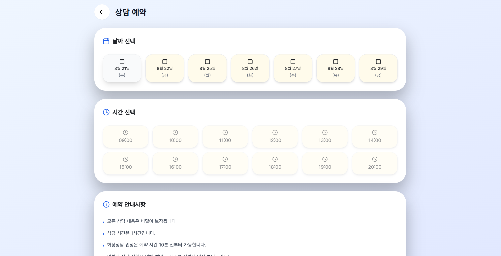
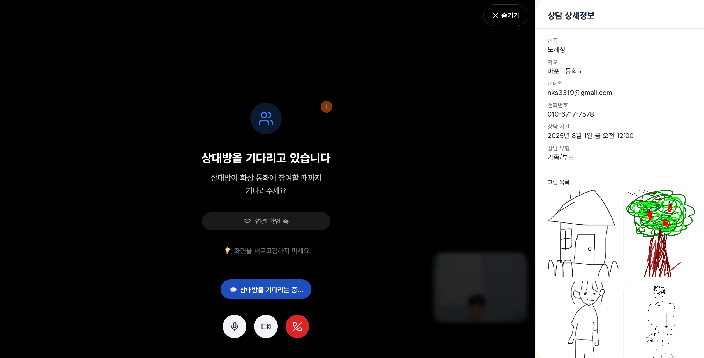
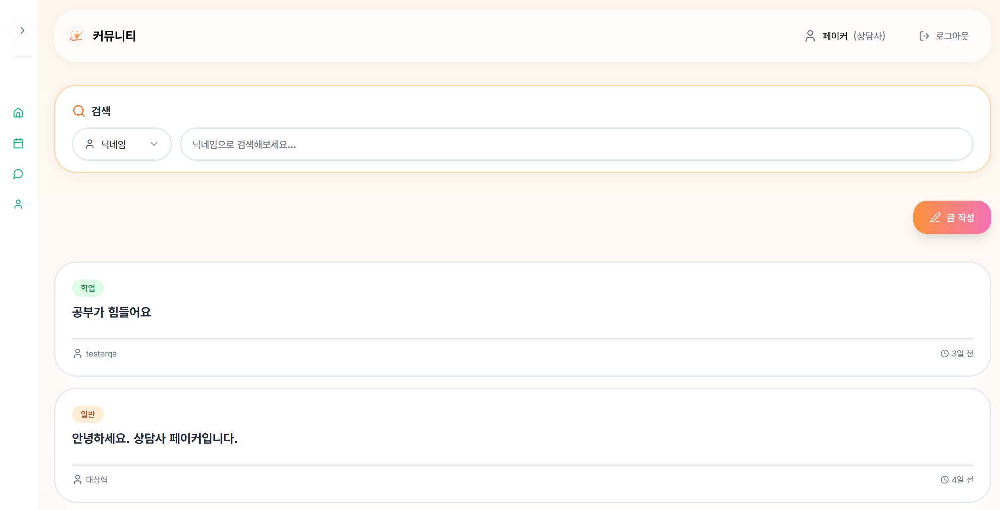

# Maum Canvas

## 1. 서비스 소개

- 정신 건강 관리에 도움을 줄 수 있는 다양한 상담 기법과 방법들을 활용할 수 있는 웹 서비스 구축
- 다양한 심리 문진을 포함하여 문진의 한계점인 심리적 압박감에 대한 한계를 해소할 수 있는 그림 검사까지 도입하여 심리 건강 관리에 도움을 주고자 함
- 높은 접근성을 가진 온라인 문진 및 상담 웹 서비스로 현재 정신 건강 서비스의 한계점 극복

## 2. 팀 소개

- Tetonam

|팀원|담당|주요 업무|
|---|---|---|
|유정석|INFRA|CI/CD|
|전재욱|BE|API 개발|
|김현서|BE,AI|API 개발, PPT, AI 모델|
|노혜성|FE|FE 개발|
|박진호|FE, AI|FE 개발, AI 모델|

## 3. 기술 스택

- **Backend** :  
  
  
  
  
  
  
  

- **FrontEnd** :  
  
  
  

- **DB** :  
  
  
  
  
- **INFRA** :  
  
  
  
  
  
  

## 4. 주요 기능

1. **그림 검사**
   - 객체 탐지부터 RAG-LLM을 활용한 AI 활용으로 상담사와 피상담자 모두 신뢰도 높고 효율성 좋은 검사 과정 제공
2. **WebRTC 통한 온라인 상담**
   - 이전 검사 및 상담 내역을 상담사가 확인할 수 있도록 하여 피상담자의 특징을 활용하 상담 가능
3. **예약 및 상담 내역**
   - 이전 검사 및 상담 내역, 예약 상담 내역 모두 제공하여 지속적인 상담 및 심리 건강 관리에 도움
4. **커뮤니티**
   - 권한 구분하여 또래들부터 상담사와의 커뮤니티까지 다양한 분류의 커뮤니티 제공

## 5. 배포 특이사항

### porting manual

[실행 및 배포하러가기!](./exec/porting_manual.md)

## 6. ERD

## 7. CI/CD

[CI/CD 구성](./docs/CICD_산출물.pdf)  

## 8. API 명세서

[API 및 기능 명세](./docs/E108_마음%20캔버스%20API%20명세서.pdf)

## 9. AI 관련 문서(HTP)

[AI RAG Pipeline 구축](./docs/HTP%20검사%20해석%20RAG%20pipeline구축.pdf)  
[AI RAG 최종 평가](./docs/HTP%20검사%20해석%20RAG%20최종%20평가.pdf)

## 10. 미리보기

  
  
  
  
  
  
  
